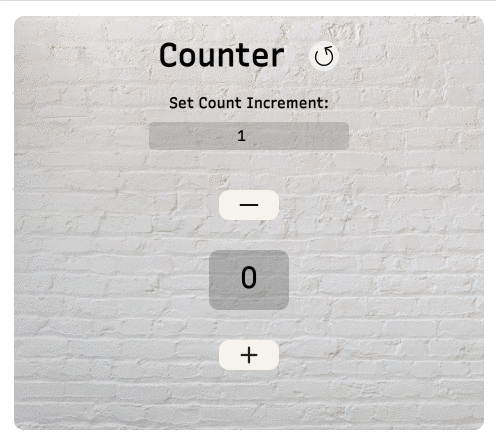

# Javascript Counter

## Table of Contents
1. [General Info](#general-info)
2. [Built With](#built-with)
3. [License](#license)
4. [Contact](#contact)

### General Info
This app is a counter. It is used to increase or decrease the 0 value by clicking on the plus and minus buttons.
It is possible to reset the counter with the appropriate icon.
It is also possible to set an increment value other than 1. 
Project Link: https://github.com/GiorgiaAmato/JavaScript_Counter.git

### Screenshot

## Built With
A list of technologies used within the project:
* [HTML5](https://developer.mozilla.org/it/docs/Web/HTML)
* [CSS3](https://developer.mozilla.org/it/docs/Web/CSS)
* [JAVASCRIPT](https://developer.mozilla.org/it/docs/Web/JavaScript)

## License
Distributed under the MIT License. See [LICENSE](https://github.com/GiorgiaAmato/JavaScript_Counter/blob/main/LICENSE) for more information.

## Contact
Giorgia Amato - amatogiorgia1@gmail.com  
Project Link: https://github.com/GiorgiaAmato/JavaScript_Counter.git 
***

